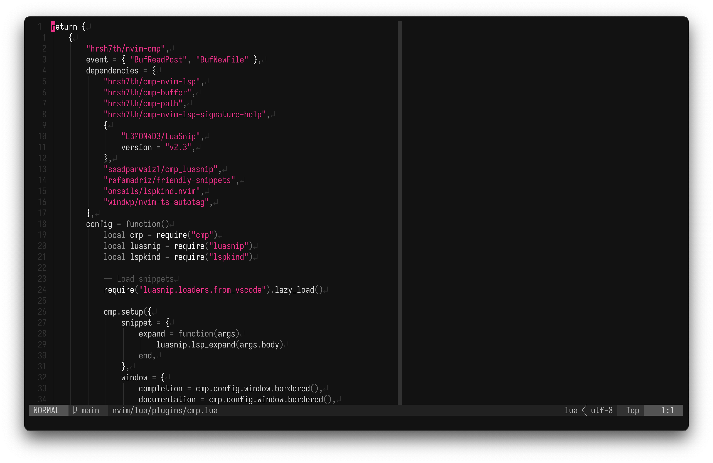

<h1 align="center"><b>D.O.T.F.I.L.E.S</b></h1>
<p align="center"></p>
<p align="center">Dotfiles for my macOS setup</p>

### Setup

For the environment setup run the `run.sh` script. Make sure you run `chmod +x` on it first.

```console
$ chmod +x ./run.sh && ./run.sh
```

The following will be installed:

* [bat](https://github.com/sharkdp/bat)
* [btop](https://github.com/aristocratos/btop)
* [docker](https://www.docker.com/products/cli/)
* [eza](https://github.com/eza-community/eza)
* [fastfetch](https://github.com/fastfetch-cli/fastfetch)
* [fnm](https://github.com/Schniz/fnm)
* [fzf](https://github.com/junegunn/fzf)
* [git-delta](https://github.com/dandavison/delta)
* [go](https://go.dev/)
* [jq](https://github.com/jqlang/jq)
* [lazygit](https://github.com/jesseduffield/lazygit)
* [mkcert](https://github.com/FiloSottile/mkcert)
* [neovim](https://github.com/neovim/neovim)
* [ripgrep](https://github.com/BurntSushi/ripgrep)
* [starship](https://github.com/starship/starship)
* [utf8proc](https://github.com/JuliaStrings/utf8proc)
* [tmux](https://github.com/tmux/tmux)
* [zoxide](https://github.com/ajeetdsouza/zoxide)
* [zsh-autocomplete](https://github.com/marlonrichert/zsh-autocomplete)
* [1Password](https://1password.com/)
* [Firefox Developer Edition](https://www.mozilla.org/en-US/firefox/developer/)
* [Ghostty](https://github.com/ghostty-org/ghostty)
* [NordVPN](https://nordvpn.com/)
* [Numi](https://numi.app/)
* [OrbStack](https://orbstack.dev/)
* [Rectangle](https://rectangleapp.com/)
* [WezTerm](https://wezfurlong.org/wezterm/index.html)
